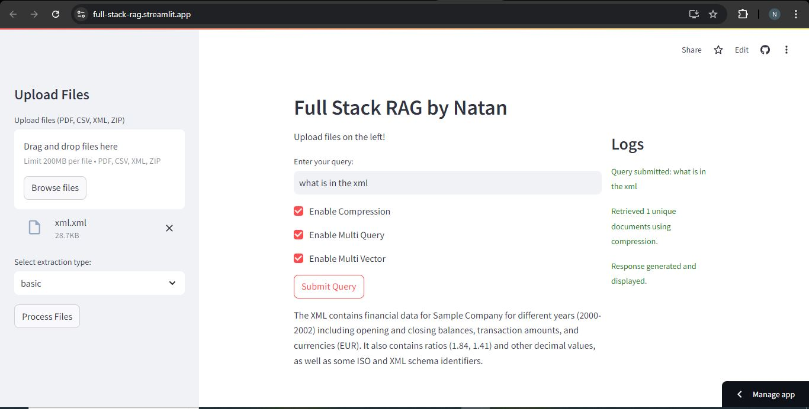

# Full Stack Retrieval-Augmented Generation (RAG) Project

This project showcases a full-stack Retrieval-Augmented Generation (RAG) pipeline using `Langchain` and `Streamlit`. The system loads documents, processes them, and generates answers for user queries with integrated logging for showing the process behind the scenes.

View Live Site [here](https://full-stack-rag.streamlit.app/)



## Key Features
- **Document Loading**: Handles PDFs, XMLs, CSVs, and ZIP files.
- **Embeddings**: Generates document embeddings using a custom HuggingFace embedding model.
- **MultiVector Retriever**: Efficient retrieval of relevant documents based on the embeddings.
- **Query Expansion and Transformation (Multi-Query)**: Expands and reformulates user queries to enhance retrieval accuracy and surface more relevant information.
- **Proposition-Based Retrieval**: Converts propositions or statements into standalone sentences to help isolate relevant information for better understanding.
- **Contextual Compression**: Compresses document context intelligently, presenting only the most relevant sections based on the user's query.
- **Streamlit Interface**: Provides a user-friendly interface for query inputs and results.
- **Logging**: Logs all processes for monitoring and debugging.

## Setup

1. Clone the repository:
    ```bash
    git clone https://github.com/Natan-Asrat/full_stack_rag.git
    cd full_stack_rag
    ```

2. Activate virtual environment: 
    ```bash 
    call venv/Scripts/activate.bat
    ```
3. Install dependencies: 
    ```bash 
    pip install -r requirements.txt 
    ```
4. Create environment variables 
- `OCR_AGENT=unstructured.partition.utils.ocr_models.tesseract_ocr.OCRAgentTesseract` ,  
- `LANGCHAIN_API_KEY` and 
- `GROQ_API_KEY`. 
- You can get your langchain api key from [here](https://smith.langchain.com/), and your groq api key from [here](https://console.groq.com/keys).


## Running the Application

To start the Streamlit application:

```bash
streamlit run app.py
```
This will start the Streamlit app, allowing you to upload documents, submit queries, and view results.

## Example Workflow
1. Open the application in your browser.
2. Upload one or more documents (PDF, XML, CSV, or ZIP) through the upload widget.
3. Enter a query in the text box.
4. Click "Submit" to receive answers based on the uploaded documents.
5. Project Structure


# Libraries
- Langchain
- Langchain Groq
- Langchain Core
- Langchain Community
- Unstructured
- Pdfminer
- pi_heif
- onnx
- pdf2image
- pikepdf
- google-cloud-vision
- effdet
- unstructured-inference
- unstructured.pytesseract
- pysqlite3-binary
- chromadb


## Contact
 - LinkedIn: [Natan Asrat](https://linkedin.com/in/natan-asrat)
 - Gmail: nathanyilmaasrat@gmail.com
 - Telegram: [Natan Asrat](https://t.me/fail_your_way_to_success)
 - Youtube: [Natville](https://www.youtube.com/@natvilletutor)

